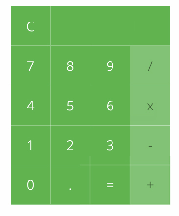

# Build a Calculator

## Directions

This exercise will help you understand how to use JavaScript functions and algorithms. You will also work with the DOM and respond to user input.
Our objective is to create a working calculator with HTML, CSS, and JavaScript, and we are going to tackle this in two stages.

### Step 1: Set up your project

- Create an `index.html` file
- Create a `main.css` file and link it to your `index.html` file
- Create a `main.js` file and link it to your `index.html` file

### Step 2: Build out the HTML and CSS

- Write your HTML and CSS to generate an image that looks like a calculator. If you'd like a specific guide, you can use the images below, but you are 
not obligated to style it exactly like this.

| Mockup                       | In Action                    |
| ---------------------------- | ---------------------------- |
|  |  |

### Step 3: Make it Click

- First use JavaScript to capture click events on the page and console log the target of those events.
- Example: If the user clicks on the 2 button, they will see `2` in the JavaScript Console.
- Once you have this working, you can move on to part 2 of this assignment, where you will be manipulating the DOM to create the appearance of a working calculator. NOTE YOU DO NOT NEED TO CREATE A NEW REPO FOR PART 2
